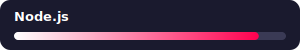
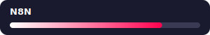

<!--
**oktajianto/oktajianto** is a ✨ _special_ ✨ repository because its `README.md` (this file) appears on your GitHub profile.

Here are some ideas to get you started:

- 🔭 I’m currently working on ...
- 🌱 I’m currently learning ...
- 👯 I’m looking to collaborate on ...
- 🤔 I’m looking for help with ...
- 💬 Ask me about ...
- 📫 How to reach me: ...
- 😄 Pronouns: ...
- ⚡ Fun fact: ...
-->

  
  
  
  

---

### About Me

- Membangun website, aplikasi mobile & desktop sejak **2019**
- Full-stack Developer @ **PT Halim Inti Gahara**
- Berbasis di Kab. Semarang, Jawa Tengah, Indonesia
- Fokus: Web Development, Mobile App (Flutter), Desktop App (Electron/Tauri), AI Integration & Automation (N8N)
- Bisa dihubungi lewat oktajianto99@gmail.com

---

### Experience

| Periode | Perusahaan | Peran |
|---|---|---|
| 2025 – Sekarang | **PT Halim Inti Gahara** | Full-stack Developer *(Full time)* |
| 2024 – Sekarang | **Nest Academy** | Full-stack Developer *(Part time)* |
| 2020 – Sekarang | **Smart Edukasi Indonesia** | Flutter Android & iOS Developer *(Hybrid)* |
| 2019 – Sekarang | **Smart Edukasi Indonesia** | Desktop / macOS App Developer *(Hybrid)* |
| 2019 – Sekarang | **Smart Edukasi Indonesia** | Full-stack Developer *(Hybrid)* |

---
### Tech Stack

<!--  -->

<!--  -->
<!--  -->

> Arahkan kursor ke tiap ikon untuk melihat nama tool-nya (tooltip).

---

### Skill Level

**Pemrograman**

<table>
<tr>
<td></td>
<td></td>
</tr>
<tr>
<td></td>
<td></td>
</tr>
<tr>
<td></td>
<td></td>
</tr>
</table>

**Desain**

<table>
<tr>
<td></td>
<td></td>
</tr>
<tr>
<td></td>
<td></td>
</tr>
</table>

**Lainnya**

<table>
<tr>
<td></td>
<td></td>
</tr>
<tr>
<td></td>
<td></td>
</tr>
</table>

---

### Portfolio

**Website**
- [xionco.com](https://www.xionco.com)
- [smartcpns.id](https://www.smartcpns.id)
- [bimbelnestacademy.com](https://bimbelnestacademy.com)
- [nestcpns.com](https://nestcpns.com)

**Mobile App**
- [SmartCPNS — Play Store](https://play.google.com/store/apps/details?id=com.smartcpns.edu)
- [SmartCPNS — App Store](https://apps.apple.com/id/app/smartcpns-skd-cpns-kedinasan/id6459510308)

**Desktop App**
- [SmartCPNS Desktop](https://www.smartcpns.id/smartcpnsdesktop)

---

### GitHub Stats

